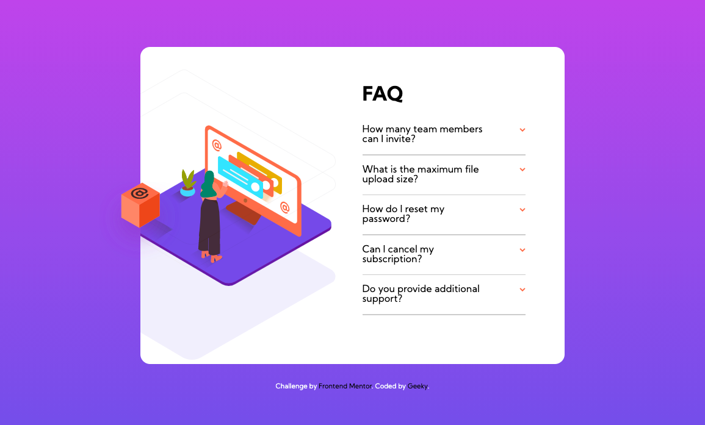

# Frontend Mentor - FAQ accordion card solution

This is a solution to the [FAQ accordion card challenge on Frontend Mentor](https://www.frontendmentor.io/challenges/faq-accordion-card-XlyjD0Oam).

## Table of contents

- [Overview](#overview)
  - [The challenge](#the-challenge)
  - [Screenshot](#screenshot)
  - [Links](#links)
- [My process](#my-process)
  - [Built with](#built-with)
  - [What I learned](#what-i-learned)
  - [Continued development](#continued-development)
  - [Useful resources](#useful-resources)
- [Author](#author)
- [Acknowledgments](#acknowledgments)

## Overview

### The challenge

Users should be able to:

- View the optimal layout for the component depending on their device's screen size
- See hover states for all interactive elements on the page
- Hide/Show the answer to a question when the question is clicked

### Screenshot

- Desktop
  


### Links

- [Solution URL](https://github.com/geeky-amat/faq-accordion-card-main)
- [Live Site URL](https://geeky-amat.github.io/faq-accordion-card-main/)

## My process

### Built with

- Semantic HTML5 markup
- CSS custom properties
- Flexbox
- JavaScript


### What I learned

- I learnt to animate the appearance and disappearance of a block using javascript, which in this case were the answers to different questions.
- Also learnt to center an absolutely positioned image (or any other block) whose dimension is not fixed using javascript.
- When an object is absolutely positioned w.r.t. one of the sections in a flexbox container then the units in percentages refer to the width of that section rather than the width of the whole flexbox.
- CSS native variable can't be used to define the breakpoints in media queries as follows
```css
:root {
  --mobile_width: 375px;
}
@media (max-width: var(--mobile_width)) {
  /* some code */
}
```
This is because media query is not a CSS element and it doesn't inherit from the ':root'. [Found this answer on stackoverflow](https://stackoverflow.com/a/40723269/16570555). 

### Continued development

- I could make the javascript part more efficient by not having to loop over all the question whenever a user views the answer to a single question by clicking on it. I probably need to learn event delegation and data attribute to make the code more efficient.
- Since I used CSS as well as javascript for styling to make images more responsive, while refreshing the page, there is an abrupt change in the locations of object probably because of conflicting properties. This can be sorted out to make the experience smoother and jerk-free.


### Useful resources

- [How can I transition height: 0; to height: auto; using CSS?
](https://stackoverflow.com/a/3149710/16570555) - This helped me animate the appearance and disappearance of answers to questions.
- [Understanding vertical-align, or "How (Not) To Vertically Center Content"](http://phrogz.net/css/vertical-align/index.html) - This article helped me figure out the way to align items in the center vertically.
- [5 ways to vertically center with CSS](https://www.youtube.com/watch?v=qJVVZYTYA9U) - This video gives a range of methods to align objects in the center vertically. One way that stands out for me is the simple `margin: auto;` on a flex-child or grid-child which otherwise doesn't center things vertically.

## Author

- Frontend Mentor - [@geeky-amat](https://www.frontendmentor.io/profile/geeky-amat)


## Acknowledgments

Almost all of the resources that helped me build this page have been mentioned is [Useful resources](#useful-resources) section.
